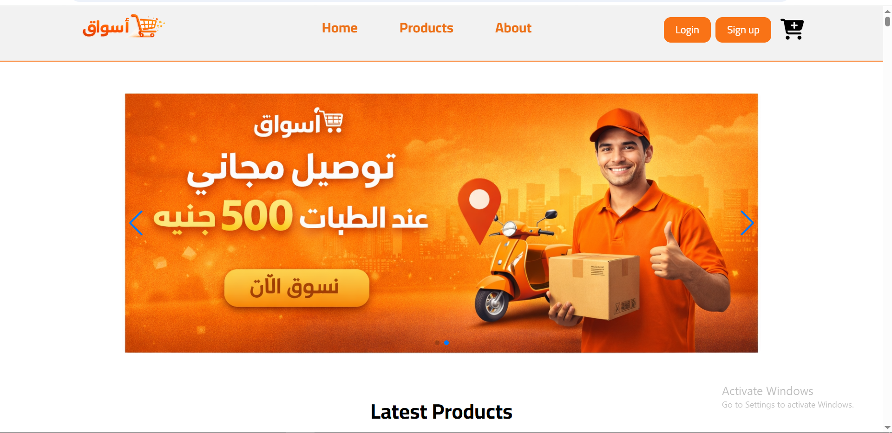
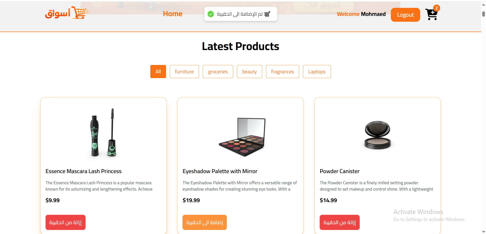
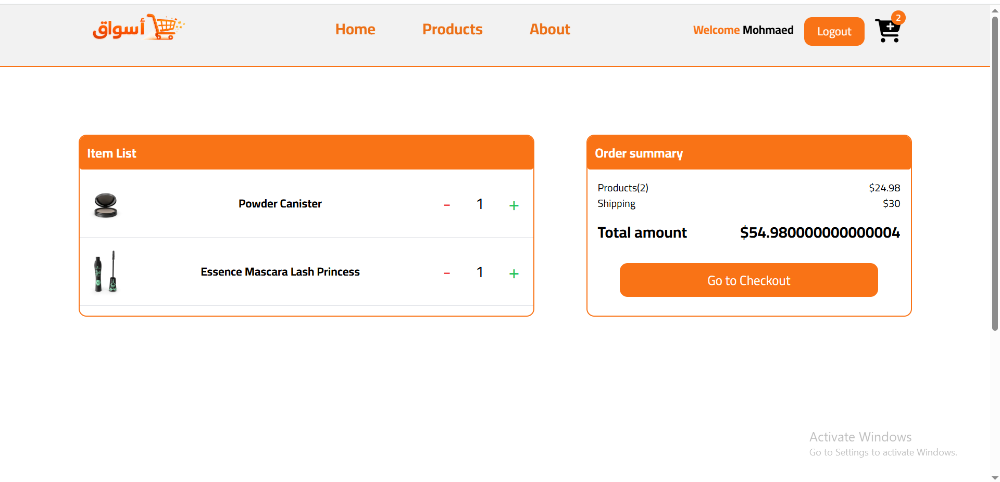
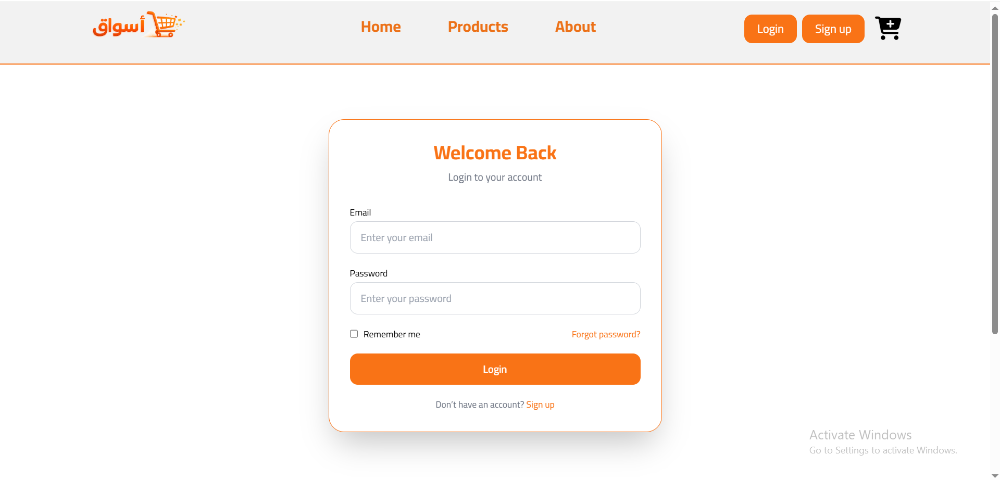
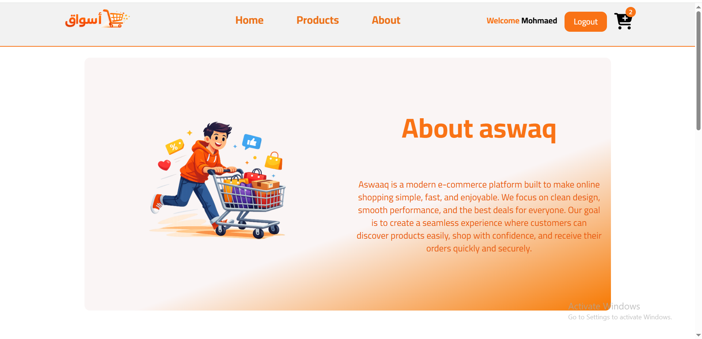
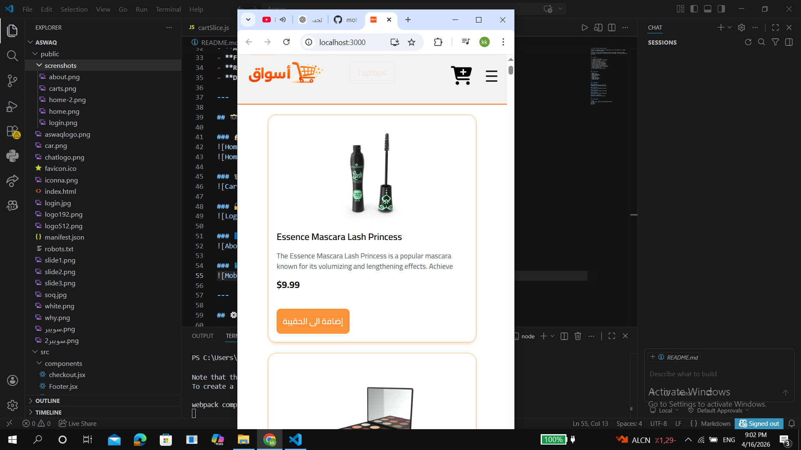

# Getting Started with Create React App

This project was bootstrapped with [Create React App](https://github.com/facebook/create-react-app).

## Available Scripts

In the project directory, you can run:

### `npm start`

Runs the app in the development mode.\
Open [http://localhost:3000](http://localhost:3000) to view it in your browser.

The project provides a smooth shopping experience with product browsing, category filtering, cart management, authentication using localStorage, and responsive design for all devices.

---

## 🚀 Features

- 🏠 Responsive Home Page
- 🛍️ Product listing from DummyJSON API
- 🔍 Category filtering
- 🛒 Add / remove products from cart
- ➕➖ Increase & decrease quantity
- 💰 Dynamic cart total and shipping
- 🔐 Login & Signup with localStorage
- 👤 Current user session handling
- 📱 Fully responsive navbar + mobile menu
- ✨ Smooth animations with Framer Motion
- 🔔 Toast notifications
- 📄 About page with animated cards

---

## 🛠️ Built With

- **React.js**
- **Redux Toolkit**
- **React Router DOM**
- **Tailwind CSS**
- **Axios**
- **Framer Motion**
- **React Hot Toast**
- **DummyJSON API**

---

## 📸 Screenshots

### 🏠 Home Page



### 🛒 Cart Page


### 🔐 Login Page


### ℹ️ About Page


### 📱 Mobile Responsive


---

## ⚙️ Installation

```bash
git clone https://github.com/yourusername/aswaq.git
cd aswaq
npm install
npm start